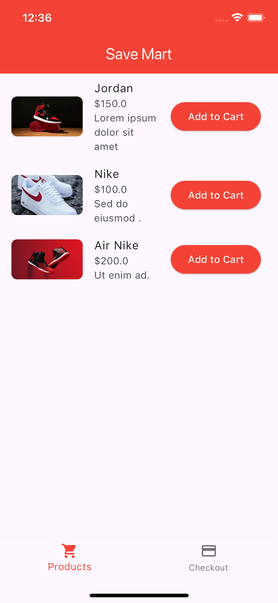
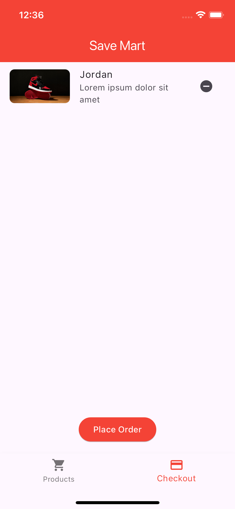
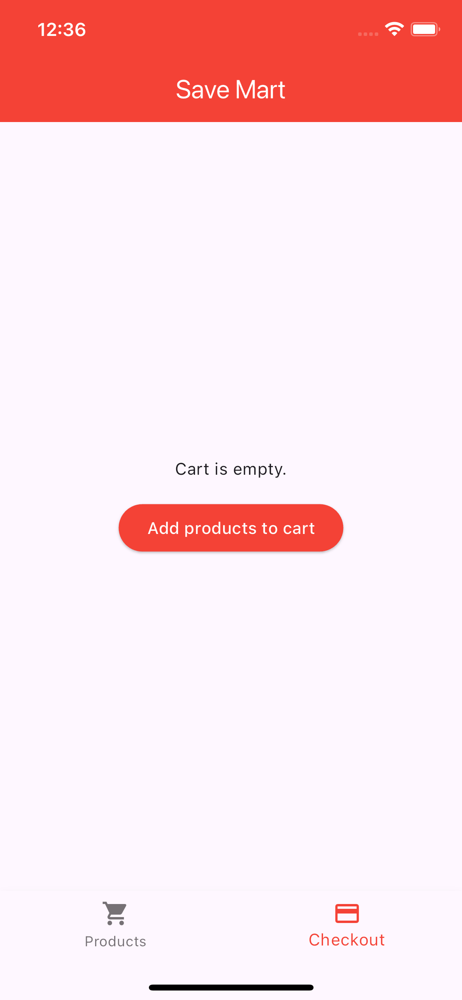

#Task One
# Save Mart

Save Mart is a simple shopping app built with Flutter. It displays a list of products and provides a checkout screen where users can add or remove items from their cart and place orders.

## Features

- Bottom navigation bar with Products and Checkout screens.
- List of products with images, descriptions, and prices.
- Ability to add and remove items from the cart.
- Order success screen.
- User-friendly and intuitive UI.

## Screenshots






## APK Download

Download the APK file for the app [here](https://www.upload-apk.com/yYooLfUVhmaGHFV).

## Setup Instructions

Follow these instructions to set up and run the app locally.

### Prerequisites

- Flutter SDK: [Install Flutter](https://flutter.dev/docs/get-started/install)
- An IDE like Android Studio or Visual Studio Code with Flutter and Dart plugins.

### Installation

1. **Clone the repository:**

   ```bash
   git clone https://github.com/cruso003/HNG_Mobile.git
   cd HNG_Mobile
   cd TaskOne
   cd save_mart
   ```
2. **Get the dependencies:**

```bash
flutter pub get
```
**Run the app:**

```bash
flutter run
```
**Building the APK**
To build the APK, run the following command:

```bash
flutter build apk
```
The APK file will be generated in the build/app/outputs/flutter-apk/ directory.

**Appetize.io Showcase**
You can try the app virtually via Appetize.io [here](https://appetize.io/app/yrhymw75xywgcejafv3cfqfz5u).